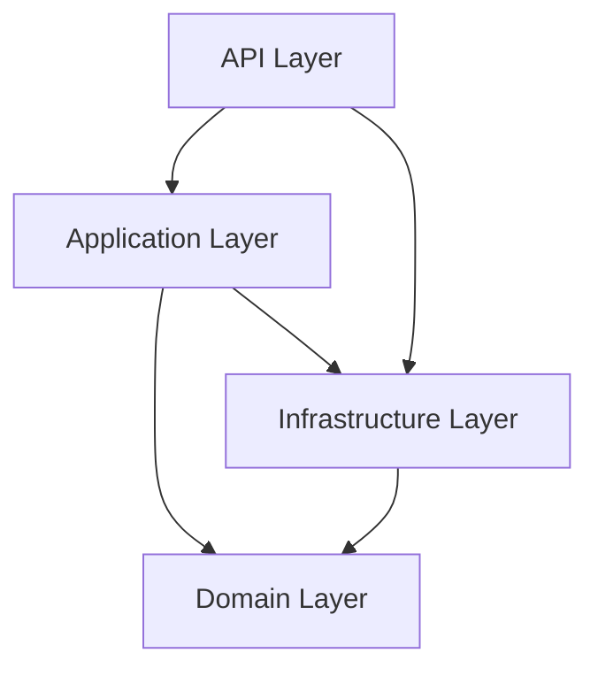

# MovieCatalog System Patterns

## Architecture Overview
MovieCatalog follows a Clean Architecture approach with distinct layers that separate concerns and dependencies:

## Domain-Driven Design (DDD)
- **Aggregates**: Core domain concepts (Movie, Actor, Genre) implemented as aggregate roots
- **Entities**: Domain objects with identity and lifecycle
- **Value Objects**: Immutable objects that describe domain concepts
- **Domain Events**: Events that represent significant changes in domain state
- **Repository Interfaces**: Defined in the domain layer for persistence abstraction

## Command Query Responsibility Segregation (CQRS)
- **Commands**: Represent intentions to change system state (handled by command handlers)
- **Queries**: Represent requests for information (handled by query handlers)
- **Separate Models**: Different models for read and write operations
- **MediatR**: Used for implementing the mediator pattern for commands and queries

## Event Sourcing
- **Event Store**: Stores domain events as the source of truth
- **Event Handlers**: Process domain events to update read models
- **Projections**: Transform events into read models
- **Marten**: Used for event sourcing and document storage

## Repository Pattern
- **Repository Interfaces**: Defined in the domain layer
- **Repository Implementations**: Provided in the infrastructure layer
- **Unit of Work**: Manages transactions and persistence operations

## Mediator Pattern
- **Request/Response**: Commands and queries follow request/response pattern
- **Pipeline Behaviors**: Cross-cutting concerns implemented as behaviors
  - Validation Behavior: Validates commands and queries
  - Logging Behavior: Logs command and query execution
  - Exception Behavior: Handles exceptions in a consistent way

## Messaging Pattern
- **Message Broker**: RabbitMQ for event distribution
- **Message Handlers**: Process messages from the message broker
- **Wolverine**: Used for message handling and routing

## Validation Pattern
- **Fluent Validation**: Used for command and query validation
- **Validation Behavior**: MediatR pipeline behavior for validation

## Dependency Injection
- **Service Registration**: Services registered in DI container
- **Constructor Injection**: Dependencies injected through constructors
- **Scoped Lifetime**: Repository and service lifetimes managed by DI container
